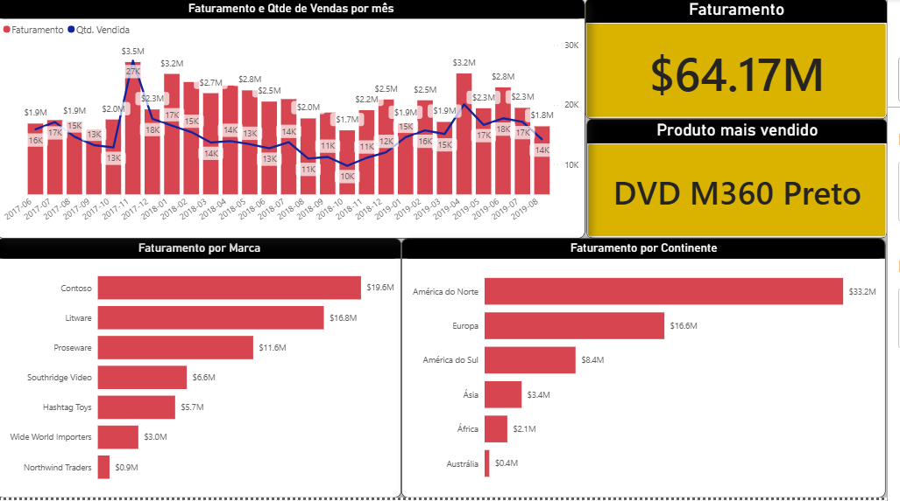
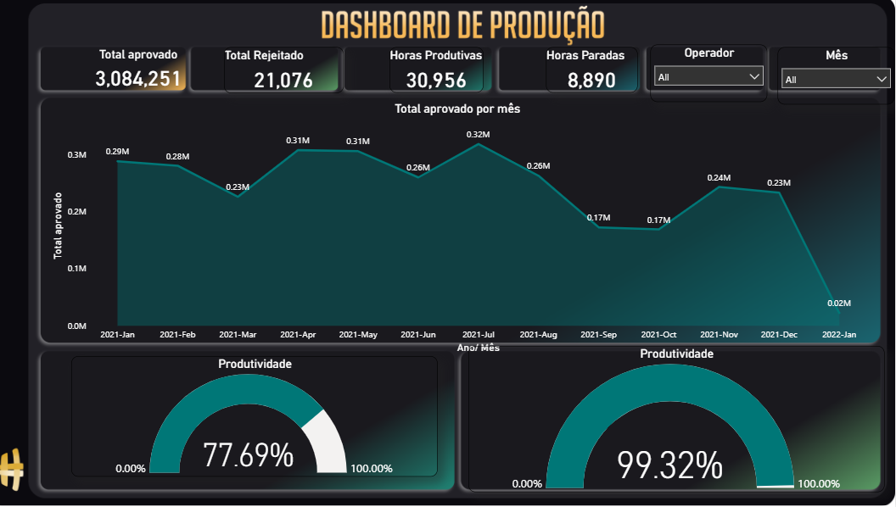

# Dashboard_Sales
Power BI Sales Dashboard


---

## 📌 Project Overview

Power BI dashboards focused on **sales analysis** , **manufacturing productivity** and **HR**, showcasing data modeling, DAX calculations, and data visualization best practices.


---

## Sales

This first Power Bi presents :
Revenue by Brand
Revenue and Sales Quantity by Month
Revenue by Continent


<table>
  <tr>
    <td align="center">
      <a href="#" title="Age">
        <br>
      </a>
    </td>
  </tr>
</table>

```
Codes 
:AnoMes = FORMAT('Planilha1'[Data da Venda], "YYYY-MM")

AnoMesOrdenacao = 
YEAR('Planilha1'[Data da Venda]) * 100 +
MONTH('Planilha1'[Data da Venda])

Mes = FORMAT('Planilha1'[Data da Venda], "MMM")
MesNum = MONTH('Planilha1'[Data da Venda])
```


## Manufactor

The second one focuses on:
Productivity
Produced Items
Total Hours Worked
Approved / Rejected Parts

<table>
  <tr>
    <td align="center">
      <a href="#" title="Age">
        <br>
      </a>
    </td>
  </tr>
</table>

```
Code:
worked_hours = sum('BaseProdução'[Total Horas]) 
hours_produced = CALCULATE(SUM('BaseProdução'[Total Horas]),'BaseProdução'[Ocorrência]=blank()) 
```
---


---

## 🛠️ Technologies Used

* Power BI
* Dax

---

## 🤝 Author

<table>
  <tr>
    <td align="center">
      <a href="https://www.linkedin.com/in/thalesfreirefarias/" target="_blank">
        <br>
        <sub><b>Thales Farias</b></sub>
      </a>
    </td>
  </tr>
</table>
